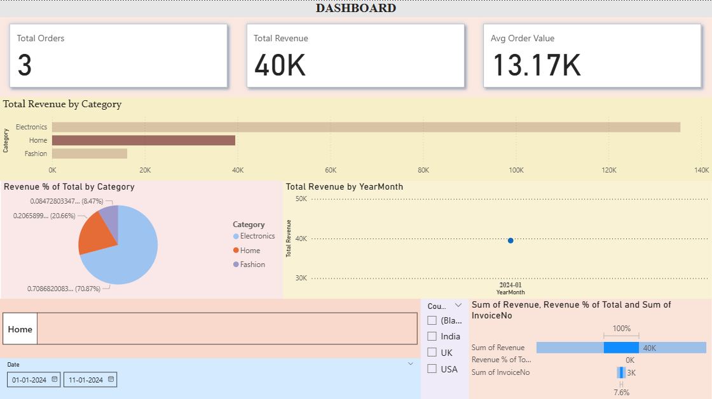

# 📊 E-Commerce Sales Dashboard (Data Science & Analytics Project)

This project is created as part of **Future Interns – Data Science & Analytics Internship (Task 1)**.  
It demonstrates how to clean raw data in **Excel**, analyze sales using **Power BI Desktop**, and build an **interactive dashboard** for business insights.

---

## 🔎 Project Workflow

### 1. Data Preparation in Excel
- Imported raw sales data (`raw_sales.xlsx`).
- Converted data into an **Excel Table** for easier handling.
- Performed quick cleaning:
  - Removed cancelled invoices (InvoiceNo starting with “C”).
  - Removed zero/negative quantities.
  - Removed rows with missing `InvoiceDate` or `Description`.
- Added a **Revenue column**:
  ```excel
  =[@Quantity] * [@UnitPrice]
Saved the cleaned file as sales_cleaned.xlsx.
2. Data Modeling in Power BI

Loaded the cleaned Excel file into Power BI Desktop.

Renamed the main table to FactSales.

Created a DimDate table using DAX:

DimDate =
ADDCOLUMNS(
    CALENDAR(MIN(FactSales[InvoiceDate]), MAX(FactSales[InvoiceDate])),
    "Year", YEAR([Date]),
    "MonthNumber", MONTH([Date]),
    "MonthName", FORMAT([Date], "MMMM"),
    "YearMonth", FORMAT([Date],"yyyy-MM"),
    "Quarter", "Q" & FORMAT([Date],"Q")
)


Marked DimDate as the official Date Table.

Built relationships:

FactSales[InvoiceDate] → DimDate[Date]

(Optional) FactSales[StockCode] → DimProduct[StockCode].

3. DAX Measures

Key measures created:

Total Revenue = SUM(FactSales[Revenue])
Total Orders = DISTINCTCOUNT(FactSales[InvoiceNo])
Total Quantity = SUM(FactSales[Quantity])
Unique Customers = DISTINCTCOUNT(FactSales[CustomerID])
Avg Order Value = DIVIDE([Total Revenue], [Total Orders], 0)


Time intelligence:

Revenue LY = CALCULATE([Total Revenue], SAMEPERIODLASTYEAR(DimDate[Date]))
Revenue YoY % = DIVIDE([Total Revenue] - [Revenue LY], [Revenue LY], BLANK())
Revenue Prev Month = CALCULATE([Total Revenue], PREVIOUSMONTH(DimDate[Date]))
Revenue MoM % = DIVIDE([Total Revenue] - [Revenue Prev Month], [Revenue Prev Month], BLANK())


Top product:

Top Product =
VAR t =
    TOPN(1,
        SUMMARIZE(FactSales, FactSales[Description], "Rev", [Total Revenue]),
        [Total Revenue], DESC
    )
RETURN CONCATENATEX(t, FactSales[Description], ", ")

4. Dashboard Creation

Built visuals in Report View:

KPI Cards

Total Revenue

Total Orders

Avg Order Value

Unique Customers

Bar Chart → Total Revenue by Category (Electronics, Home, Fashion).

Pie Chart → Revenue % by Category.

Line Chart → Revenue trend by YearMonth.

Filters / Slicers

Date slicer

Region/Country slicer

Card Visual → Top Product.

5. Dashboard Preview

📌 Example output (screenshot):


🛠 Tools Used

Microsoft Excel → Data cleaning & preprocessing

Power BI Desktop → Data modeling, DAX measures, dashboard visualization

GitHub → Project hosting & sharing

📂 Repository Structure
Future_DS_Sales_Dashboard/
│
├── Data/
│   ├── raw_sales.xlsx          # Original dataset
│   ├── sales_cleaned.xlsx      # Cleaned dataset
│
├── SalesDashboard.pbix         # Power BI dashboard file
│
├── screenshots/
│   └── dashboard.png           # Screenshot of final dashboard
│
└── README.md                   # Documentation


Open SalesDashboard.pbix in Power BI Desktop.

Explore the dashboard interactively with slicers and filters.
